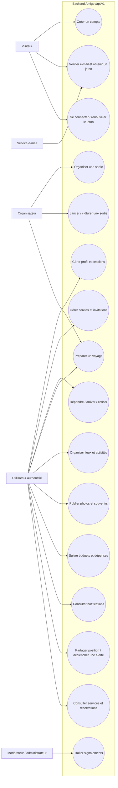
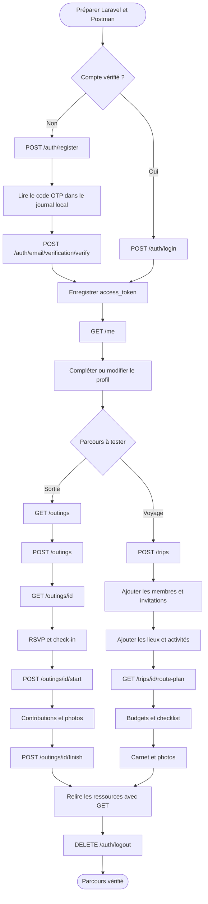

# Cas d’utilisation du backend Amigo

Ce document explique quels acteurs utilisent l’API, dans quel ordre appeler ses routes pour faire fonctionner les parcours principaux, et comment vérifier ces parcours dans Postman.

> **État d’intégration :** les routes backend décrites ici sont disponibles sous `/api/v1`. L’application Expo `amigoApp` utilise encore ses jeux de démonstration locaux et n’appelle pas encore cette API. Ce document est donc le plan d’intégration frontend et le guide fonctionnel des appels backend, pas la description d’un flux déjà connecté dans l’application.

## Documentation à ouvrir

- [Guide Postman complet](POSTMAN.md) : environnement, authentification, import de la collection et exemples de requêtes.
- [Spécification OpenAPI](api.json) : schémas des requêtes et réponses pour les routes documentées.
- Interface interactive Scramble, après démarrage du serveur : `http://127.0.0.1:8000/docs/api`.

## Règles communes

- URL locale de base : `http://127.0.0.1:8000/api/v1`.
- Les routes métier demandent `Authorization: Bearer <access_token>` et `Accept: application/json`.
- Les routes publiques sont `POST /auth/register`, `POST /auth/login`, `POST /auth/refresh`, les routes de vérification d’e-mail, de récupération du mot de passe et `POST /auth/two-factor/verify`. `DELETE /auth/logout`, `PUT /auth/password` et les routes d’activation/désactivation du 2FA demandent un Bearer. `/discover/trips` reste également protégée par authentification dans la configuration actuelle.
- Les identifiants de ressources sont des UUID. Après chaque `POST`, conserver `data.id` pour appeler les routes de détail et d’action.
- Utiliser les champs API en snake_case, par exemple `first_name`, `location_type` et `date_label`.
- Utiliser les schémas de `api.json` ou l’import OpenAPI dans Postman pour connaître les champs requis, les valeurs autorisées et les paramètres de chaque endpoint.

## Diagramme de cas d’utilisation



## Parcours recommandé pour intégrer l’application

Les étapes sont ordonnées par dépendance : les fonctions de groupe et de contenu ont besoin d’un utilisateur authentifié et les opérations de détail ont besoin de l’UUID créé précédemment.

| Ordre | Fonction à connecter | Routes à appeler | Résultat attendu |
| --- | --- | --- | --- |
| 1 | Inscription et session | `POST /auth/register`, `POST /auth/email/verification/verify`; ensuite `POST /auth/login` et `POST /auth/refresh` selon le besoin | Compte vérifié et `access_token` stocké de façon sécurisée dans l’application. |
| 2 | Profil | `GET /me`, `PATCH /me`, routes avatar, e-mail et sessions | L’écran compte affiche les données serveur et les modifications persistent après rechargement. |
| 3 | Cercles et invitations | CRUD `/circles`, CRUD `/invitations`, `POST /invitations/{id}/respond` ou `/invitations/respond` | Les personnes invitées sont des comptes identifiés; les réponses viennent du backend. |
| 4 | Parcours sortie minimal | `GET /outings`, `POST /outings`, `GET /outings/{id}` | Une sortie créée apparaît dans la liste et reste disponible après fermeture/réouverture de l’app. |
| 5 | Actions de sortie | RSVP, check-in, start, contributions, photos, Story, finish sous `/outings/{id}` | Les actions modifient la ressource backend et le détail rechargé reflète le nouvel état. |
| 6 | Parcours voyage | CRUD `/trips`, `/trip-members`, `/trip-places`, `/activities`, `/activity-attendees`, `/meeting-points`, `/packing-items` | Le voyage, ses membres, ses lieux, son programme et sa checklist sont persistés. |
| 7 | Budget et souvenirs | `/budgets`, `/budget-lines`, `/expenses`, `/expense-participants`, `/settlements`, `/trip-journal-entries`, `/photos`, `/photo-comments` | Le budget, les dépenses et les souvenirs sont partagés entre les membres autorisés. |
| 8 | Fonctions complémentaires | lieux, sondages, notifications, préférences, appareil, position, urgence, recommandations, services | Ajouter ces modules après validation des parcours cœur; plusieurs demandent des services externes ou des droits spécifiques. |

## Diagramme du scénario Postman principal

```mermaid
flowchart TD
  start([Démarrer Laravel et Postman]) --> auth{Compte vérifié ?}
  auth -->|Non| register[POST /auth/register]
  register --> otp[Lire le code OTP dans le journal local]
  otp --> verify[POST /auth/email/verification/verify]
  auth -->|Oui| login[POST /auth/login]
  verify --> token[Enregistrer access_token dans token]
  login --> token
  token --> me[GET /me]
  me --> list[GET /outings]
  list --> create[POST /outings]
  create --> show[GET /outings/{id}]
  show --> rsvp[POST /outings/{id}/rsvp]
  rsvp --> checkin[POST /outings/{id}/check-in]
  checkin --> startouting[POST /outings/{id}/start]
  startouting --> contribute[POST /outings/{id}/contributions]
  contribute --> photo[POST /outings/{id}/photos]
  photo --> story[PATCH /outings/{id}/photos/{photoId}/story]
  story --> finish[POST /outings/{id}/finish]
  finish --> verifyresult[GET /outings/{id} pour vérifier l’état final]
```

Pour les payloads exacts de ce scénario et l’enregistrement automatique de `token`, `outing_id` et `photo_id` dans Postman, suivre [POSTMAN.md](POSTMAN.md).

## Parcours utilisateur complet, de A à Z

Ce diagramme montre les deux parcours principaux après l’authentification. Une première sortie valide le cycle de vie événementiel; un voyage valide ensuite l’organisation sur plusieurs jours.



### Checklist chronologique

#### A. Préparer l’environnement

- [ ] Depuis `amigo`, configurer `.env`, appliquer `php artisan migrate`, puis démarrer `php artisan serve`.
- [ ] Pour lire les codes e-mail en local, utiliser `MAIL_MAILER=log` et `QUEUE_CONNECTION=sync`, ou démarrer un worker avec `php artisan queue:work` si la queue reste sur `database`.
- [ ] Importer `api.json` dans Postman; créer un environnement avec `base_url`, `token`, `user_id`, `circle_id`, `trip_id`, `outing_id` et `photo_id`.
- [ ] Configurer la collection avec le Bearer `{{token}}`; désactiver l’auth héritée sur les routes publiques d’inscription, connexion et vérification.

#### B. Créer la première session

- [ ] Nouveau compte : envoyer `POST /auth/register` avec `first_name`, `email`, `password` et `password_confirmation`.
- [ ] Vérifier que la réponse est `201`; lire le code OTP dans `storage/logs/laravel.log`.
- [ ] Envoyer `POST /auth/email/verification/verify` avec l’adresse et le code; enregistrer `access_token` dans `token` et `data.id` dans `user_id`.
- [ ] Compte existant : utiliser plutôt `POST /auth/login`; un compte non vérifié ne peut pas se connecter.
- [ ] Appeler `GET /me`; vérifier le profil, puis essayer `PATCH /me` avec `first_name` et `last_name` en snake_case et relire `GET /me`.
- [ ] Essayer une route protégée sans jeton : elle doit refuser l’appel (`401`). Ne jamais enregistrer le jeton ou le code OTP dans un dépôt.

#### C. Vérifier les groupes et les invitations

- [ ] Créer un cercle avec `POST /circles`; enregistrer son UUID dans `circle_id` et vérifier avec `GET /circles/{id}`.
- [ ] Créer un second compte vérifié dans un autre environnement Postman; conserver son jeton séparément sous `member_token`.
- [ ] Après la création du cercle, créer l’invitation avec `POST /invitations` et `{"circle_id":"UUID_DU_CERCLE","channel":"email","target":"ami@example.com"}`. L’adresse peut être invitée avant que son propriétaire ait installé l’application.
- [ ] Cette route enregistre l’invitation et génère un lien `amivoy://invite/<code>`, mais n’envoie pas de courriel. Partager le lien manuellement; un lien HTTPS vers la page d’installation reste à développer pour les personnes sans l’app.
- [ ] Après installation, la personne s’inscrit/vérifie le compte avec la même adresse, se connecte, puis accepte via `POST /invitations/respond` avec `{"code":"CODE_DU_LIEN","status":"accepted"}`. L’acceptation l’ajoute au cercle.
- [ ] Vérifier le résultat avec `GET /invitations` sous les deux comptes et `GET /circles/{id}` sous le compte invité.

#### D. Tester une sortie complète

- [ ] Appeler `GET /outings` et vérifier que la liste est accessible au compte.
- [ ] Créer une sortie avec `POST /outings`. Renseigner au minimum `title`, `place`, `location_type` (`public` ou `private`) et `category`; enregistrer `data.id` dans `outing_id`.
- [ ] Si la sortie appartient à un cercle, inclure son `circle_id`; le compte doit être autorisé dans ce cercle. Pour inviter un second compte, fournir son UUID dans `participant_user_ids`.
- [ ] Lire `GET /outings/{id}` et confirmer que les champs et participants correspondent à la création.
- [ ] Sous le compte participant, envoyer `POST /outings/{id}/rsvp` avec `{"attending": true}`, puis `POST /outings/{id}/check-in`.
- [ ] Sous le compte organisateur, modifier au besoin avec l’opération `PUT` proposée par la collection, puis lancer avec `POST /outings/{id}/start`.
- [ ] Ajouter une cotisation avec `POST /outings/{id}/contributions`; vérifier que cela enregistre un montant, sans débiter d’argent.
- [ ] Envoyer une vraie image en `multipart/form-data` à `POST /outings/{id}/photos`; conserver l’UUID de la photo et tester `PATCH /outings/{id}/photos/{photoId}/story`.
- [ ] Clôturer avec `POST /outings/{id}/finish`, puis relire `GET /outings/{id}` et `GET /outings` pour confirmer l’état final.
- [ ] Avec un troisième compte non participant, tenter de lire ou modifier la sortie privée : vérifier que l’accès est refusé.

#### E. Tester un voyage complet

- [ ] Créer un voyage avec `POST /trips`; conserver `data.id` dans `trip_id`.
- [ ] Ajouter les personnes avec `/trip-members` et le mécanisme d’invitation; vérifier les droits depuis le compte organisateur et depuis un membre.
- [ ] Ajouter des destinations avec `/destination-proposals` si le groupe doit voter; créer ensuite un sondage avec `/polls`, ses choix avec `/poll-options` et les réponses avec `/poll-answers`.
- [ ] Chercher un lieu avec `GET /places/search` ou `/places/nearby`; ajouter les lieux retenus via `/trip-places`.
- [ ] Créer les activités et leurs participants avec `/activities` et `/activity-attendees`; ajouter les points de rencontre et la checklist si nécessaire.
- [ ] Appeler `GET /trips/{trip}/route-plan` après avoir ajouté des lieux avec coordonnées; vérifier l’ordre suggéré. Cette route ne fournit pas une navigation GPS.
- [ ] Créer un budget et ses lignes, enregistrer dépenses et participants, puis vérifier les règlements. Ce sont des enregistrements comptables, pas des paiements réels.
- [ ] Ajouter une entrée avec `/trip-journal-entries`, puis vérifier le détail du voyage et le carnet avec un nouvel appel `GET`.

#### F. Terminer et valider

- [ ] Tester une requête avec un corps incomplet ou invalide : le backend doit retourner `422`, et l’application doit afficher l’erreur sans perdre la saisie.
- [ ] Tester un UUID inexistant (`404`) et une action avec un compte non autorisé (`403`).
- [ ] Refaire les appels `GET` après les créations et modifications : la donnée doit persister en base, même après redémarrage de Postman.
- [ ] Consulter `/notifications`, les préférences et les jetons d’appareil seulement après que l’authentification, les parcours sortie et voyage sont validés.
- [ ] Tester les routes `/reports` et `/moderation-actions` avec un compte doté des permissions requises; elles ne font pas partie du parcours standard d’un membre.
- [ ] Terminer par `DELETE /auth/logout`; vérifier que le jeton ne peut plus être réutilisé.

**Parcours minimal prêt pour une première version :** sections A, B et D, avec les erreurs `401`, `403`, `404` et `422` testées. Les sections C et E permettent de couvrir la collaboration et les voyages; F ferme le cycle de validation et ajoute les modules réservés ou optionnels.

## Routes par cas d’utilisation

Les ressources CRUD listées ci-dessous exposent normalement `GET /{ressource}`, `POST /{ressource}`, `GET /{ressource}/{id}`, `PUT /{ressource}/{id}` et `DELETE /{ressource}/{id}`. La spécification OpenAPI reste l’autorité pour chaque schéma et autorisation.

### Identité et accès

| Route | Cas d’utilisation |
| --- | --- |
| `POST /auth/register` | Créer un compte avec prénom, e-mail et mot de passe. |
| `POST /auth/email/verification/send` | Renvoyer un code OTP de vérification. |
| `POST /auth/email/verification/verify` | Vérifier l’adresse et obtenir un jeton. |
| `POST /auth/login` | Ouvrir une session d’un compte déjà vérifié. |
| `POST /auth/refresh` | Renouveler un jeton. |
| `POST /auth/password/forgot` | Demander un code de réinitialisation. |
| `POST /auth/password/reset` | Réinitialiser le mot de passe avec le code. |
| `POST /auth/two-factor/verify` | Finaliser une connexion protégée par 2FA. |
| `GET /me`, `PATCH /me` | Lire et modifier le profil de l’utilisateur courant. |
| `PUT /me/email`, `POST /me/avatar`, `DELETE /me/avatar` | Changer l’adresse e-mail ou gérer l’avatar. |
| `PUT /auth/password`, `/auth/two-factor/*`, `DELETE /auth/logout` | Gérer mot de passe, 2FA et déconnexion. |
| `GET /me/sessions`, `POST /me/sessions/revoke-others` | Consulter les sessions et révoquer les autres appareils. |

### Cercles, invitations et activité de groupe

| Routes | Cas d’utilisation |
| --- | --- |
| CRUD `/circles` | Créer un cercle, en consulter les détails, le modifier ou le supprimer selon les droits. |
| CRUD `/invitations` | Créer et gérer les invitations associées aux groupes ou voyages. |
| `POST /invitations/respond`, `POST /invitations/{id}/respond` | Accepter ou refuser une invitation par code ou UUID. |
| CRUD `/destination-proposals` | Proposer et gérer des destinations pour un groupe. |
| CRUD `/exclusion-requests` | Gérer les demandes concernant l’exclusion d’un membre. |
| CRUD `/polls`, `/poll-options`, `/poll-answers` | Créer un sondage, ses choix et les réponses des membres. |
| CRUD `/reactions` | Ajouter ou gérer une réaction à un contenu de groupe. |
| `GET /group-activities`, `POST /group-activities` | Lire ou publier un événement dans le fil de groupe. |

### Sorties

| Route | Cas d’utilisation |
| --- | --- |
| CRUD `/outings` | Créer, lister, consulter, modifier et supprimer une sortie. |
| `POST /outings/{id}/rsvp` | Indiquer si le participant vient (`attending: true/false`). |
| `POST /outings/{id}/check-in` | Confirmer l’arrivée au point de rendez-vous. |
| `POST /outings/{id}/start`, `POST /outings/{id}/finish` | L’organisateur lance puis clôture la sortie. |
| `POST /outings/{id}/contributions` | Enregistrer une cotisation en XOF. Ce n’est pas un paiement bancaire. |
| `POST /outings/{id}/photos` | Envoyer une image et une légende en multipart. |
| `PATCH /outings/{id}/photos/{photoId}/story` | Publier/retirer une photo de la Story. |

### Voyages et itinéraires

| Route | Cas d’utilisation |
| --- | --- |
| CRUD `/trips` | Créer et gérer un voyage. |
| `GET /discover/trips`, `GET /discover/trips/{id}` | Découvrir et consulter les voyages publics; authentification toujours requise. |
| CRUD `/trip-members` | Gérer les membres d’un voyage. |
| CRUD `/trip-places` | Ajouter et gérer les lieux du voyage. |
| `GET /trips/{trip}/route-plan` | Obtenir un ordre suggéré de visite à partir des lieux du voyage. Ce n’est pas une navigation GPS. |
| `POST /trips/{trip}/notifications` | Envoyer une notification liée au voyage. |
| CRUD `/activities`, `/activity-attendees`, `/meeting-points` | Organiser le programme, ses participants et les rendez-vous. |
| CRUD `/packing-items` | Gérer la checklist de préparation du voyage. |
| CRUD `/trip-journal-entries` | Ajouter et gérer les entrées du carnet de voyage. |

### Lieux, budget et services

| Route | Cas d’utilisation |
| --- | --- |
| CRUD `/places` | Gérer les lieux du catalogue. |
| `GET /places/search`, `GET /places/nearby` | Rechercher un lieu ou les lieux proches; utiliser les paramètres indiqués par OpenAPI. |
| `GET /route-suggestions` | Obtenir des suggestions de route à partir des critères fournis. |
| CRUD `/budgets`, `/budget-lines` | Créer un budget et détailler ses lignes. |
| CRUD `/contributions`, `/expenses`, `/expense-participants`, `/settlements` | Suivre cotisations, dépenses, participants et règlements. Aucune transaction bancaire n’est réalisée. |
| CRUD `/exchange-rates` | Consulter ou administrer les taux de change. |
| CRUD `/plans`, `/subscriptions` | Gérer les offres et abonnements. |
| CRUD `/partners`, `/services`, `/bookings`, `/recommendations` | Gérer partenaires, services, réservations et recommandations. |

### Médias, sécurité et fonctionnement technique

| Route | Cas d’utilisation |
| --- | --- |
| CRUD `/photos`, `/photo-comments` | Gérer les médias et commentaires associés. |
| CRUD `/location-shares`, `/location-points` | Partager et enregistrer des positions. |
| CRUD `/emergency-alerts`, `/emergency-alert-recipients` | Déclencher et gérer les alertes d’urgence et leurs destinataires. |
| `GET /notifications`, `GET /notifications/{id}`, `PATCH /notifications/{id}/read`, `POST /notifications/read-all`, `DELETE /notifications/{id}` | Lister, consulter, marquer comme lue, tout marquer comme lu et supprimer les notifications. |
| CRUD `/notification-preferences` | Régler les préférences de notifications. |
| CRUD `/device-tokens` | Enregistrer les jetons d’appareil pour les notifications push. |
| CRUD `/reports`, `/moderation-actions` | Déclarer du contenu et gérer les actions de modération selon les rôles. |
| CRUD `/offline-sync-queue` | Enregistrer des opérations en attente de synchronisation. |

## Critères de validation d’un parcours

Un parcours est correctement connecté quand :

1. une requête sans jeton reçoit `401` sur une route protégée;
2. les appels valides utilisent le jeton de la session et des UUID renvoyés par le backend;
3. une ressource créée est retrouvée avec son `GET` de détail après une nouvelle requête;
4. une action non autorisée reçoit un `403`, et un UUID introuvable un `404`;
5. les erreurs de validation `422` sont affichées sans perdre le formulaire;
6. l’application relit ou met à jour son état à partir de la réponse backend, plutôt que de modifier uniquement les données de démonstration locales.

Pour la première version fonctionnelle, commencer par l’authentification, `GET /me`, puis le CRUD et le cycle de vie des sorties. Ajouter les voyages, dépenses, médias et notifications ensuite, un module après l’autre.