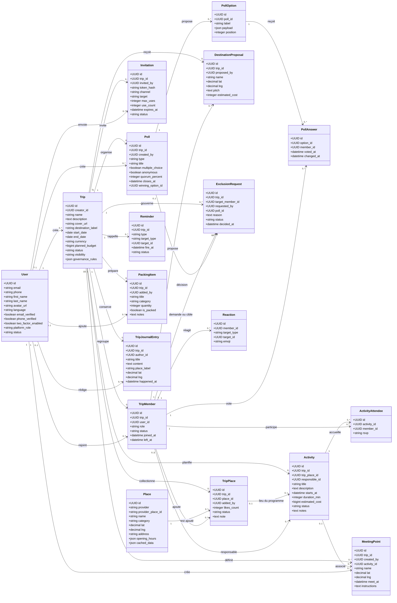
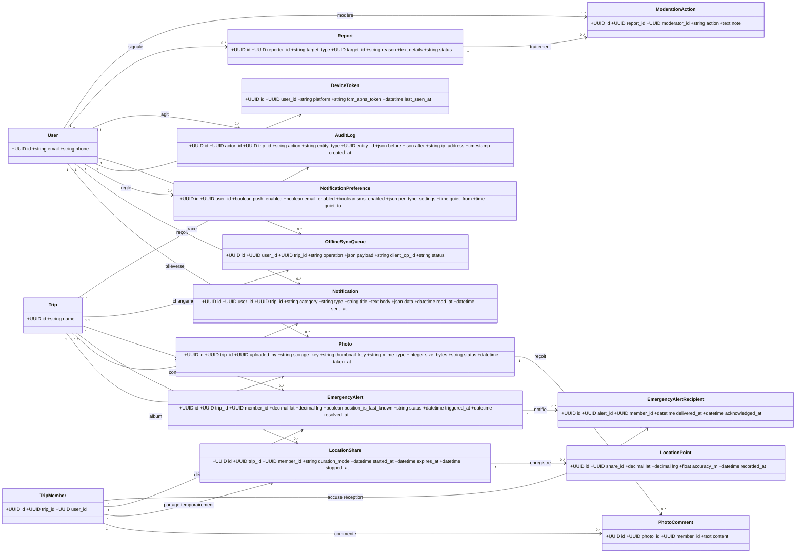
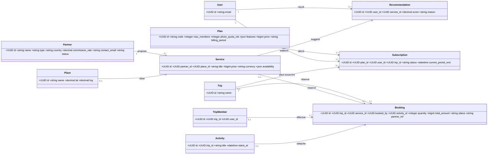
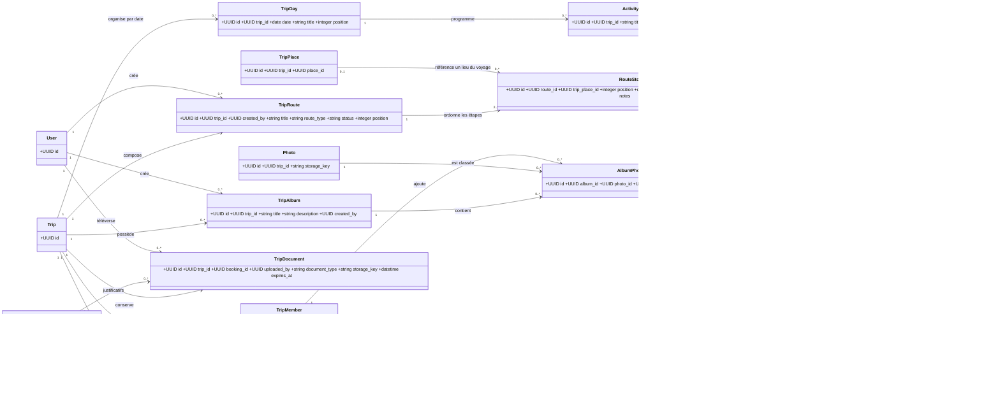

# TripVibe — diagramme des classes de la base de données

Ce document décrit **le schéma Laravel actuellement présent dans `database/migrations`**, y compris les tables ajoutées pour les listes de préparation, le carnet de voyage et la visibilité publique. Les diagrammes couvrent les fonctions au-delà du MVP : paiements, remboursements, albums, partage de position, SOS, modération, réservations, abonnements et synchronisation.

Les classes représentent les entités persistées. Les tables Laravel d’infrastructure (`cache`, `jobs`, `sessions`, etc.) ne sont pas des entités métier et sont listées à la fin. Les cardinalités ci-dessous suivent les clés étrangères de la base ; plusieurs FK sont nullable dans le schéma.

## 1. Comptes, voyages, décisions et programme

## 2. Budgets, contributions, dépenses et paiements

```mermaid
classDiagram
    direction LR
    class Trip { +UUID id +string currency +bigint planned_budget }
    class TripMember { +UUID id +UUID trip_id +UUID user_id }
    class User { +UUID id +string email }
    class Budget { +UUID id +UUID trip_id +bigint total_planned +string currency +integer version }
    class BudgetLine { +UUID id +UUID budget_id +string category +bigint planned_amount }
    class Contribution { +UUID id +UUID trip_id +UUID member_id +bigint expected_amount +bigint paid_amount +string status +date due_date }
    class Expense { +UUID id +UUID trip_id +UUID paid_by +UUID budget_line_id +string title +bigint amount +string currency +decimal fx_rate +string split_mode +datetime spent_at +string receipt_url +text comment }
    class ExpenseParticipant { +UUID id +UUID expense_id +UUID member_id +bigint share_amount +decimal share_weight }
    class Settlement { +UUID id +UUID trip_id +UUID from_member +UUID to_member +bigint amount +string status +datetime confirmed_at }
    class Payment { +UUID id +UUID user_id +UUID contribution_id +UUID settlement_id +string provider +string provider_ref +bigint amount +string currency +string status +string idempotency_key }
    class PaymentEvent { +UUID id +UUID payment_id +string event_type +json raw_payload +boolean signature_valid +datetime received_at }
    class Refund { +UUID id +UUID payment_id +bigint amount +text reason +string status +string provider_ref }
    class ExchangeRate { +UUID id +string base +string quote +decimal rate +string source +datetime fetched_at }
    Trip "1" --> "0..*" Budget : budgète
    Budget "1" --> "0..*" BudgetLine : répartit
    Trip "1" --> "0..*" Contribution : collecte
    TripMember "1" --> "0..*" Contribution : contribue
    Trip "1" --> "0..*" Expense : comptabilise
    TripMember "1" --> "0..*" Expense : avance
    BudgetLine "0..1" --> "0..*" Expense : catégorise
    Expense "1" --> "0..*" ExpenseParticipant : répartit
    TripMember "1" --> "0..*" ExpenseParticipant : doit sa part
    Trip "1" --> "0..*" Settlement : solde
    TripMember "1" --> "0..*" Settlement : émet ou reçoit
    User "0..1" --> "0..*" Payment : initie
    Contribution "0..1" --> "0..*" Payment : règle
    Settlement "0..1" --> "0..*" Payment : règle
    Payment "1" --> "0..*" PaymentEvent : journalise
    Payment "1" --> "0..*" Refund : rembourse
```

Les soldes individuels sont **calculés** à partir des dépenses et participants ; il n’existe pas de table `balances` matérialisée. `ExchangeRate` stocke les cours, mais il ne porte pas de clé étrangère vers les dépenses. Les paiements restent délégués à un prestataire : le schéma conserve des références de prestataire, pas de numéro de carte.

## 3. Photos, notifications, position, SOS et audit

## 4. Offres, partenaires et réservations

## 5. Authentification et tables techniques

Les entités applicatives d’authentification sont `User`, `UserSession` (session/appareil et empreinte du jeton de renouvellement) et `AuthChallenge` (codes temporaires à usage limité). Laravel ajoute aussi `personal_access_tokens` pour Sanctum.

Les migrations de base Laravel créent également `password_reset_tokens`, `sessions`, `cache`, `cache_locks`, `jobs`, `job_batches` et `failed_jobs`. Ce sont des tables de support du framework et non des objets de TripVibe.

## 6. Éléments du cahier des charges à modéliser plus tard

Les entités ci-dessus couvrent déjà l’essentiel du cycle complet décrit dans le cahier. Les points suivants ne sont pas des tables actuelles et ne sont **pas représentés comme implémentés** :

- Un vrai itinéraire routier calculé par un fournisseur cartographique. Aujourd’hui, les trajets suggérés de l’interface mock sont seulement des données de démonstration ; les `Place`, `TripPlace`, `Activity` et `MeetingPoint` fournissent le socle persistant.
- Des documents de voyage (billets, visas, vouchers) attachés au voyage, à une réservation ou à un jour.
- Une messagerie libre entre membres. Les notes, commentaires de photos et notifications ne remplacent pas un fil de discussion.
- Des photos séparées en albums nommés ; aujourd’hui, `Photo` est rattachée directement à un trip.
- Un historique immuable et exhaustif des changements de rôles, votes et opérations financières. `AuditLog` existe, mais ses champs sont génériques et son alimentation doit être vérifiée.
- Les modèles détaillés de transport (segments, horaires, transporteurs) et de devises de compte utilisateur.
- Les reçus sont stockés par URL dans `Expense.receipt_url` ; la gestion de fichiers sécurisée, les pièces multiples et leurs métadonnées ne sont pas modélisées comme entité dédiée.

Ces ajouts peuvent être dessinés comme extensions de domaine lorsque leurs règles sont arrêtées ; ils ne doivent pas être confondus avec les migrations actuellement présentes.

## 7. Extension proposée pour couvrir tout le produit

Les classes de cette section sont une **proposition de conception**, pas des tables présentes dans les migrations actuelles. Elles couvrent les besoins décrits dans le cahier des charges qui ne sont pas encore persistés. Les trajets recommandés et leurs étapes seraient ainsi enregistrables et modifiables par le groupe.

Avant d’ajouter ces migrations, il faudra choisir si les étapes d’un itinéraire réutilisent toujours `TripPlace`, comment les `TripDay` s’articulent avec les dates des `Activity`, et quelles permissions de rôle sont configurables. La recherche de lieux reste un accès à un fournisseur cartographique et n’exige pas une table de recherche ; seuls les lieux sélectionnés par le groupe doivent être conservés dans la base.
